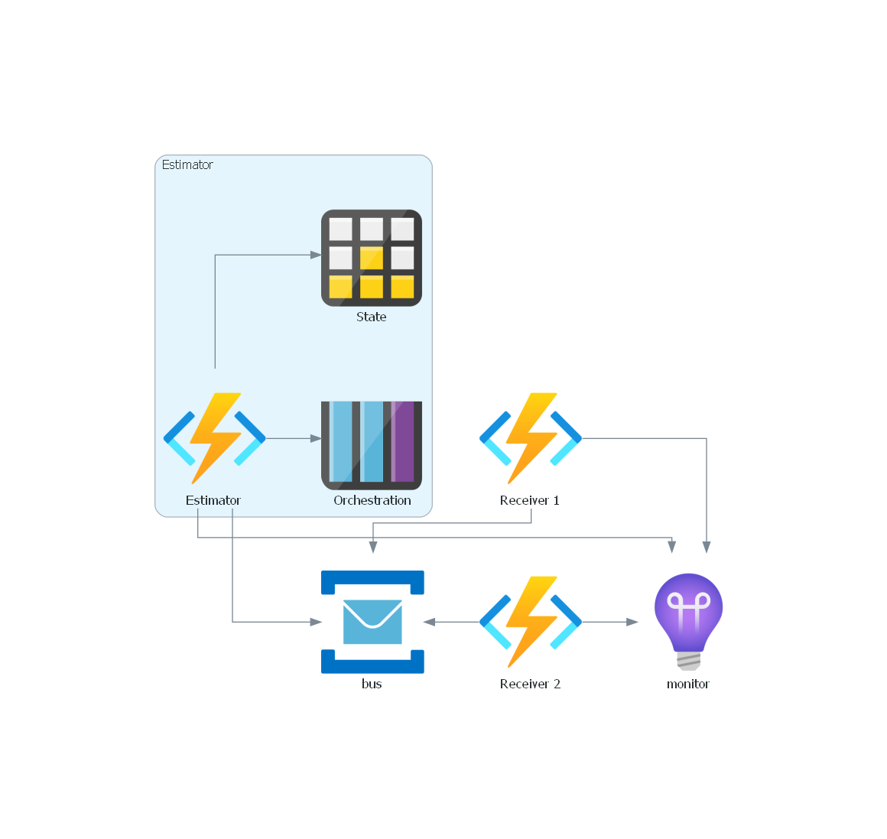
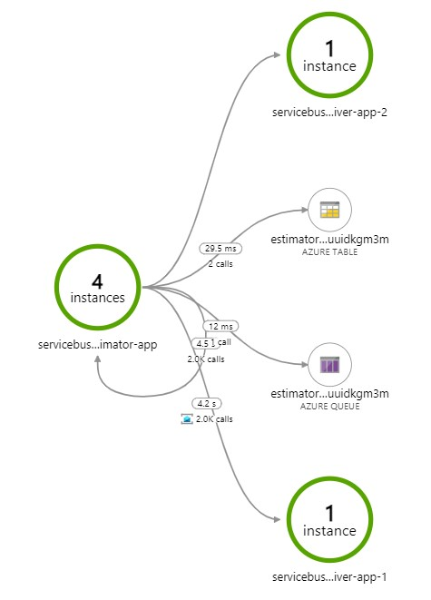
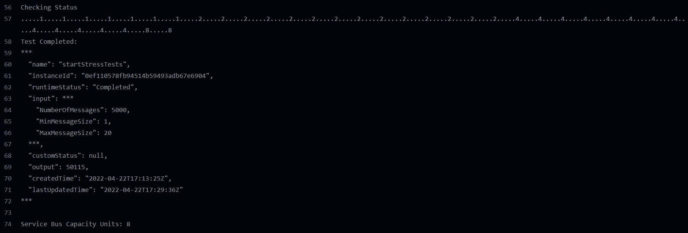

# azure-service-bus-premium-estimator
[Azure Service Bus](https://docs.microsoft.com/en-us/azure/service-bus-messaging/) Premium Estimator

## Overview
This repository demonstrates how to estimate number of capacity units of Azure Service Bus Premium based on number of messages and average size of payloads.

The solution architecture is depicted below:

The worklow will deploy the following resources:

-   **Estimator**: A [Durable Function App](https://docs.microsoft.com/en-us/azure/azure-functions/durable/durable-functions-overview) running inside of an App Service Plan that will run orchestration to send the number of given messages ranging between 1 to 20 MB of payload to the Service Bus. 
-   **Receivers**: Function Apps that will use the Service Bus [trigger](https://docs.microsoft.com/en-us/azure/azure-functions/functions-bindings-service-bus-trigger) to read messages deployed in Dynamic Function Plans.
-   **Monitor**: An [Application Insights](https://docs.microsoft.com/en-us/azure/azure-monitor/overview#application-insights) instance to review the performance metrics
-   **Autoscale**: Autoscale settings for the estimator, receivers and service bus.

## Usage
The workflow will run with the following arguments:

- MESSAGES: total number of messages to send to Service Bus, default 5000
- MIN_SIZE: minimum payload size in MB, default 1
- MAX_SIZE: maximum payload size in MB, default 20
- RECEIVERS: number of receivers to deploy, 2

You can review the metrics in the Application Insights resource, like shown below:

The recommendation for number of capacity units will be available in the **Test** stage, like shown below:

